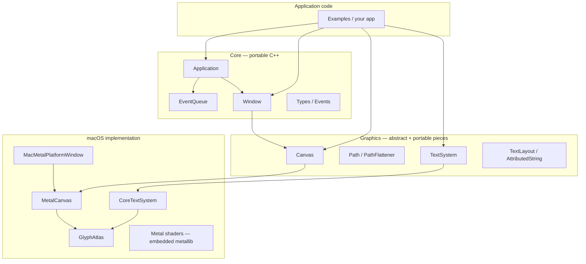

# Flux v4 — architecture

This document describes how the major pieces fit together. It is meant to stay aligned with the current tree and CMake layout.

## Layers

- **Core** (`src/Core/`, `include/Flux/Core/`): `Application`, `Window`, `EventQueue`, shared types and events. Portable except where it calls into `PlatformWindow` and graphics backends through virtual interfaces.
- **Platform** (`src/Platform/Mac/`): Cocoa / Metal window and surface wiring. `detail::createPlatformWindow` is implemented in one translation unit per platform build (no `#ifdef` branches inside portable `Window.cpp`).
- **Graphics** (`src/Graphics/`, `include/Flux/Graphics/`): Abstract `Canvas` API, CPU-side `Path` and flattening, `TextSystem` with box and unconstrained layout helpers in `TextSystem.cpp`. Metal-specific code lives under `src/Graphics/Metal/` (rasterizer, device resources, shader library, glyph atlas).

## Application and main loop

- **`Application::exec()`** runs the platform event loop. On macOS it alternates waiting for AppKit events, advancing **repeating timers** (`std::chrono::steady_clock`), posting **`TimerEvent`** to the queue, and calling **`EventQueue::dispatch()`**.
- **`Window::requestRedraw()`** (and **`Application::requestRedraw()`**) mark frames needed; when the pump runs, **`Window::render(Canvas&)`** is invoked with **`beginFrame` / `present`** wrapped by `Application` so subclasses only draw.
- **`Application::textSystem()`** returns the process-wide **`TextSystem`** (macOS: **`CoreTextSystem`**) used for measurement, layout, and glyph rasterization consumed by the Metal **`GlyphAtlas`**.

## Canvas and Metal

- **`Window::canvas()`** lazily creates a **`Canvas`** implementation (**`MetalCanvas`**) sized to the window’s drawable.
- Drawing primitives include transforms, clip rects, opacity, blend modes, rects/lines/paths/circles, and **`drawTextLayout`** for laid-out text.
- **Paths** are flattened on the CPU, then tessellated with **libtess2** in **`MetalPathRasterizer`** for fill/stroke meshes.
- **Shaders**: `CanvasShaders.metal` is compiled at build time to a **metallib**, embedded as a C array (`xxd`), and loaded from **`MetalShaderLibrary`**.

## Text

- **`TextSystem`** (virtual) provides **`layout`**, **`measure`**, **`resolveFontId`**, and **`rasterizeGlyph`**. Default implementations in **`TextSystem.cpp`** add box-constrained layout and alignment on top of backend **`layout`** / **`measure`**.
- **`CoreTextSystem.mm`** implements Core Text layout and glyph bitmap generation.
- **`GlyphAtlas.mm`** caches GPU textures for glyphs, calling back into **`TextSystem::rasterizeGlyph`** as needed.

## Dependencies (build / link)

| Dependency | Role |
|------------|------|
| **CMake FetchContent: libtess2** | Polygon tessellation for path fills |
| **Cocoa, QuartzCore, Metal, Foundation** | Windowing and GPU (macOS) |
| **CoreText** | Font resolution, shaping, rasterization for the text stack |

## Future platforms

CMake reserves **`FLUX_PLATFORM`** values for **Linux Wayland** and **KMS/DRM**; non-macOS **`AUTO`** fails at configure time until a backend exists. The intent is to keep **`PlatformWindow`** + **`createPlatformWindow`** as the extension point and to add parallel **`src/Platform/...`** trees without forking portable core logic.
