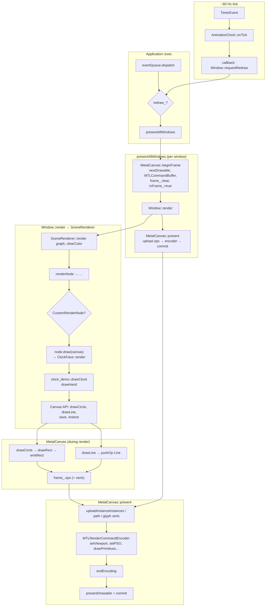

Here is a concise review of the **clock demo** and a **flow diagram** of the path from the 60 Hz tick through your view code to **Metal submission** (command buffer commit / present).

## Clock demo recap

- **`examples/clock-demo/main.cpp`**: `ClockFace` is a **`RenderComponent`**: it implements `measure` and `render(Canvas&, Rect)`. `AnimationClock::subscribe` calls `w.requestRedraw()` each tick so the app repaints ~60 Hz.
- **`examples/clock-demo/clock.hpp`**: `drawClock` / `drawHand` call **`Canvas::drawCircle`**, **`Canvas::drawLine`**, and **`save`/`restore`** (for hand rotation math).

The **scene graph is built during layout/rebuild** (`BuildOrchestrator::rebuild`), not on every animation tick. Each **draw frame** only **replays** the recorded `CustomRenderNode` lambda, which calls `ClockFace::render` again so wall-clock time updates every frame.

---

## End-to-end flow (to Metal)

### 1. What schedules frames

```text
Application::scheduleRepeatingTimer (~60 Hz)
  → TimerEvent on EventQueue
  → AnimationClock::onTick
  → subscriber callback: w.requestRedraw()
  → Window::postRedraw → Application::requestRedraw (sets redraw_, wakes run loop)
```

### 2. Main loop presents

```text
Application::exec (each iteration)
  → eventQueue.dispatch()
  → if redraw_: Application::presentAllWindows()
```

### 3. Per-window present (CPU record → GPU submit)

```text
Application::presentAllWindows()
  for each Window:
    canvas.beginFrame()          // MetalCanvas: nextDrawable + MTLCommandBuffer, clear frame_ ops
    w->render(canvas)            // SceneRenderer walks graph; CustomRenderNode invokes lambda
    canvas.present()             // upload buffers, encode render pass, commit, presentDrawable
```

### 4. Where `ClockFace` hooks in (rebuild vs every frame)

**On rebuild** (`Runtime::rebuild` → `BuildOrchestrator::rebuild`):

```text
rootHolder_->layoutInto → Element::layout …
renderLayoutTree(layoutTree, rctx)
  → … → Element::Model<C>::renderFromLayout  (RenderComponent path)
        → detail::emitCustomRenderNode(ctx, frame, λ)
             SceneGraph stores CustomRenderNode { draw: λ }
             λ calls copy.render(canvas, frame)   // only when SceneRenderer runs, not here
```

Actually `emitCustomRenderNode` only **stores** the lambda; **`SceneRenderer::render`** invokes it each frame.

**Every redraw**:

```text
Window::render
  → SceneRenderer::render(graph, canvas, clearColor)
       canvas.clear(clearColor)
       renderNode(root) …
       CustomRenderNode → canvas.save(); node.draw(canvas); canvas.restore();
            → λ → ClockFace::render(canvas, frame)
                 → clock_demo::drawClock(...)
                      Canvas::drawCircle / drawLine / save / restore
```

### 5. Metal backend: record vs submit

On **`beginFrame`**, MetalCanvas acquires a drawable and command buffer and clears the **CPU-side** frame recorder (`frame_.clear()`).

During **`Window::render`**, **`MetalCanvas::drawCircle`** (via **`drawRect`**) and **`drawLine`** do **not** touch the GPU immediately; they **`pushOp`** into `frame_.ops` (plus path/glyph data as needed).

On **`present`**, MetalCanvas:

- Uploads instance/path/glyph data (`metal_.upload*`)
- Builds **`MTLRenderPassDescriptor`** (clear to drawable texture)
- **`[cmdBuf_ renderCommandEncoderWithDescriptor:pass]`** — encodes batched rect/line/image/path/glyph draws
- **`[enc endEncoding]`**
- **`[cmdBuf_ presentDrawable:drawable_]`** + **`[cmdBuf_ commit]`** (async path) — this is where work is **submitted** to the GPU queue

---

## Diagram (Mermaid)



---

## Pseudocode (single frame)

```text
// Already built scene graph from last rebuild; contains CustomRenderNode with λ.

MetalCanvas::beginFrame():
  frame_.clear()
  wait(frameSemaphore)
  drawable = layer.nextDrawable()
  cmdBuf = queue.commandBuffer()
  glyphAtlas.prepareForFrameBegin()

Window::render(canvas):
  SceneRenderer.render(sceneGraph, canvas, clearColor):
    canvas.clear(clearColor)
    walk graph:
      LayerNode → save/transform/clip → children
      CustomRenderNode:
        canvas.save()
        draw(canvas)   // λ: ClockFace.render(canvas, frame)
        canvas.restore()

ClockFace::render(canvas, frame):
  // wall-clock time
  clock_demo.drawClock(canvas, frame, hDeg, mDeg, sDeg)
    drawHand → canvas.save/restore, canvas.drawLine(...)
    canvas.drawCircle(...)  // Metal: drawRect rounded pill

MetalCanvas::drawLine / drawRect (emitRect):
  pushOp(MetalDrawOp::Line or Rect) into frame_.ops   // CPU record only

MetalCanvas::present():
  metal.upload*(frame_.ops, verts…)
  pass = renderPassDescriptor(drawable.texture, clearColor)
  enc = cmdBuf.renderCommandEncoder(pass)
  for batched ops: enc.setRenderPipelineState, drawPrimitives…
  enc.endEncoding()
  cmdBuf.presentDrawable(drawable)
  cmdBuf.commit()
  // GPU executes after commit
```

---

## Files to anchor the story

| Stage | Primary code |
|--------|----------------|
| Redraw request | `examples/clock-demo/main.cpp` (`subscribe` → `requestRedraw`) |
| Exec + present | `src/Core/Application.mm` (`exec`, `presentAllWindows`) |
| Scene draw | `src/Core/Window.cpp` (`Window::render`), `src/Scene/SceneRenderer.cpp` |
| Custom view → graph | `include/Flux/UI/Element.hpp` (`emitCustomRenderNode` + lambda), `src/UI/Detail/RenderComponentEmit.cpp` |
| Graph + layout rebuild | `src/UI/BuildOrchestrator.cpp` (`rebuild` → `renderLayoutTree`) |
| Metal record + submit | `src/Graphics/Metal/MetalCanvas.mm` (`beginFrame`, `drawLine`/`drawRect`/`present`) |

**Takeaway:** From the clock demo’s perspective, **`ClockFace::render` → `drawClock` → virtual `Canvas` calls** is the app-side pipeline; **`SceneRenderer`** dispatches **`CustomRenderNode::draw`**; **`MetalCanvas`** **records** draw ops during `render`, then **`present`** **uploads**, **encodes** the render pass, and **`commit`s** the command buffer to Metal.